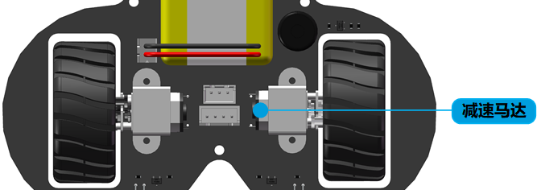

探索者机器人硬件介绍
=====================

电源系统
--------

锂电池
~~~~~~~~

机器人由一块容量为2000 mAh的可充电聚合物锂电池供电，典型情况下可提供最大5小时的续航时间。

充电接口
~~~~~~~~~~

在机器人的左侧提供了一个USB充电接口，当机器人需要充电时请将产品附带的USB线或者兼容的USB
线缆为机器人充电，USB线缆一端连接机器人USB充电接口，另外一端连接充电器（比如手机或平板电脑充电器）或者电脑的USB插座。

充电指示灯
~~~~~~~~~~~

在USB充电接口的下方有一个LED充电指示灯，当充电开始后指示灯为绿色，电池充满后指示灯熄灭。

电源开关
~~~~~~~~~~~

机器人的电源开关位于机器人的右侧，将机器人开关拨至ON状态打开电源，拨至OFF状态关闭电源。

动力系统
--------

探索者机器人动力系统采用三轮后驱布局，由驱动轮提供动力和提供导向

底盘驱动
~~~~~~~~~~~

机器人配备了两个独立的驱动轮，每个驱动轮由一个直流减速马达提供动力。驱动轮的方向和速度
均可通过软件控制，支持0-100无级变速和正反向控制。编程和控制方法请参考本文档其它章节。

导向轮
~~~~~~~~~~~

导向轮主要为机器人提供导向功能，使机器人的运动更加灵活。

旋转云台
----------

旋转云台位于机器人的上方，由一个伺服舵机驱动，目前云台上面安装了超声波雷达，可以控制云台
和超声波雷达去探测机器人周围不同方向的障碍物以及障碍物的距离。

灯光系统
----------

机器人配备了丰富的灯光系统，包括前置探照灯、后置尾灯和底盘氛围灯

探照灯
~~~~~~~

探照灯位于机器人主板的前方，由两颗高亮白色LED组成。每颗探照灯LED的亮度均可通过软件调节。

尾灯
~~~~~~~

尾灯位于机器人主板的后方，由两颗高亮红色LED组成。每颗尾灯LED的亮度均可通过软件调节。

氛围灯
~~~~~~~

氛围灯位于机器人主板的底部，由3颗RGB LED组成，呈三角形分布。每颗氛围灯的颜色均可通过软件编程
设定，实现炫酷的灯光效果。

音频系统
----------

机器人利用蜂鸣器播放音乐，在设计的时，microbit主板的P0引脚被用作蜂鸣器的控制引脚。

传感器
---------

机器人通过传感器感知外部世界，除了microbit自带的传感器，探索者机器人还配备了
超声波雷达、红外巡线传感器以及红外遥控传感器以赋予机器人更强大的感知能力。

超声波雷达
~~~~~~~~~~

超声波雷达传感器利用超声波用来测量机器人前方障碍物的距离，它包括一个发射端和一个接收端，发射端
发生超声波信号，遇到障碍物信号被反射到接收端，利用超声波被反射的时间差和空气中的声速计算前方障碍物的距离。

超声波雷达的探测范围为2cm-400cm，2cm以内为盲区，数据是不准确的。

红外巡线传感器
~~~~~~~~~~~~~~~

在机器人的底部前方位置安装了两个独立的红外巡线传感器，当传感器下方为黑色表面时（例如黑色胶带），发出信号
通知机器人。

当任何一个传感器遇到黑线时，对应的传感器指示灯（红色）会亮起，离开黑线时，指示灯熄灭。

红外遥控传感器
~~~~~~~~~~~~~~~

.. image:: ../images/hardware/ir-receiver-sensor.png
   :width: 509px 
   :height: 233px
   :scale: 70 %
   :align: center

在机器人的最前方安装了红外遥控传感器，用来接收红外遥控器的按键指令。此外，产品还配备了一款17键的遥控器，
用来控制机器人。

产品规格
---------

========  =====================
规格       参数    
========  =====================
产品名称    探索者机器人
产品型号    DD-RB-WL-01
额定功率    1W
工作电压    DC 3.6~4.2 V 
电池类型    聚合物锂离子电池
电池容量    2000 mAh
续航时间    5.5 h           
产品尺寸    L123*W132*H104 mm
包装尺寸    L200*W150*H60 mm
产品净重    207 g
驱动方式    两轮差分
电机类型    直流减速电机
最高速度    1.2 m/s
传感器      红外遥控、红外循迹、超声波
========  =====================

