第一个机器人程序
=======================================

你可以利用MakeCode开发环境（积木块语言）或者Python（文本语言）为机器人编写程序，
本例子我们选择MakeCode做为我们的编程工具。我们将演示如何为机器人编程点亮机器人底盘
的氛围灯并且设置为不同的颜色

第1步 连接机器人和电脑
----------------------

- 将机器人通过附带的micro USB线缆一端连接到电脑，另一端连接到microbit主板的USB接口

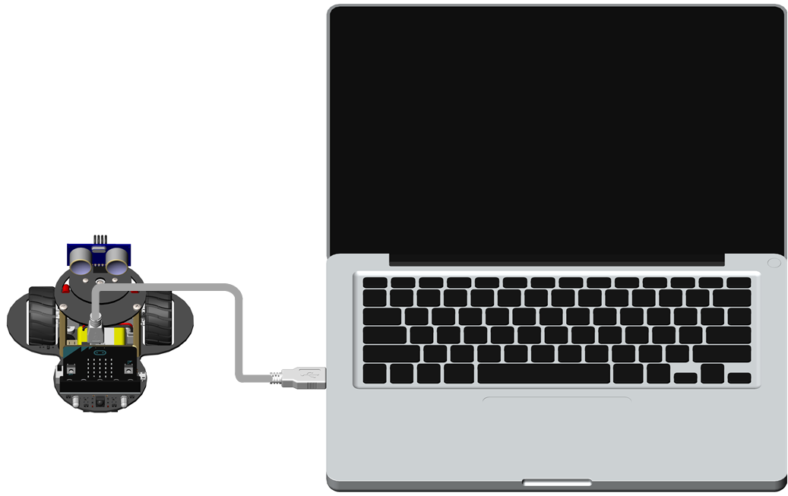

- 过一会儿在电脑中将会出现一个名字为 **MICROBIT** 的磁盘，这是microbit存放程序的地方，我们将在后面的步骤里将生成的程序拷贝到这个磁盘里面

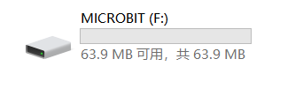

第2步 创建一个工程
----------------------

- 请首先确保你的电脑可以访问互联网，打开浏览器，进入 `MakeCode <https://makecode.microbit.org/>`_ 编程主界面

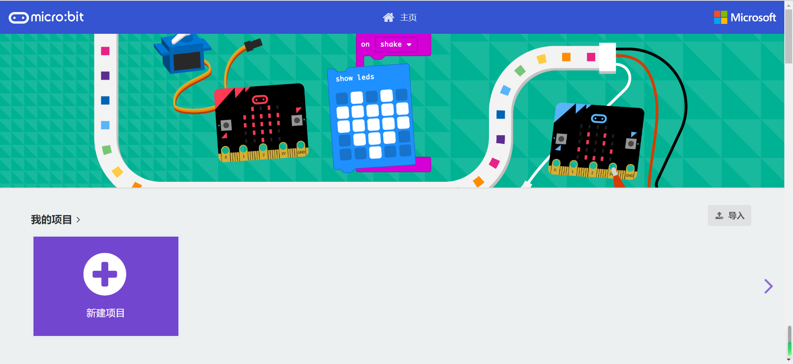

- 点击界面编程界面的 **新建项目** 按钮创建一个新的项目

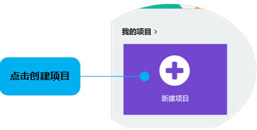

- 为项目取一个名字，比如我们这儿叫做 **first-program** ，当然你可以为项目取任何你喜欢的名字

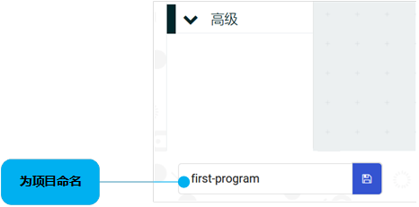

- 最终创建完工程后的编程界面将是这样的

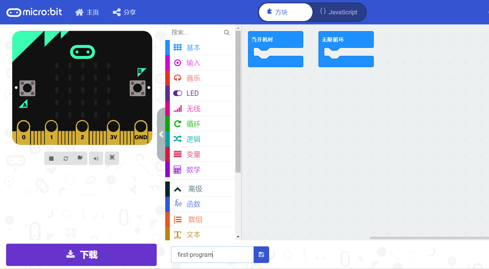

第3步 加载机器人扩展插件
---------------------------

- 在编程界面的中间依次选择 **高级** - **扩展** 进入扩展插件搜索界面

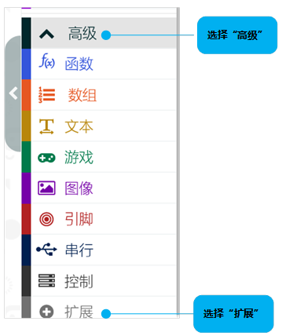

- 在搜索框中输入插件地址 **https://github.com/didabot/pxt-explorer-robot** 并点击右侧的搜索图标搜索插件

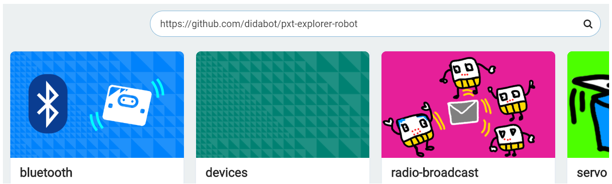

- 在搜索的结果中选择名字为 **pxt-explorer** 的插件加载

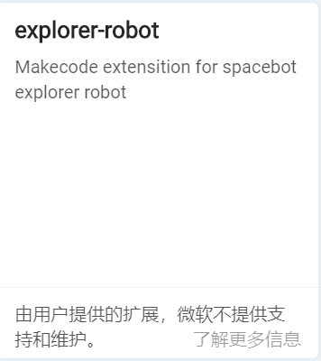

加载完毕后新的插件将出现在编程界面的中部位置

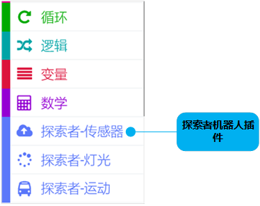

第4步 编写并下载程序
---------------------------

- 在积木列表里面依次选择 **探索者** - **灯光**，并将 **设置所有底盘灯颜色为** 语句用鼠标拖到 **当开机时** 逻辑块里面

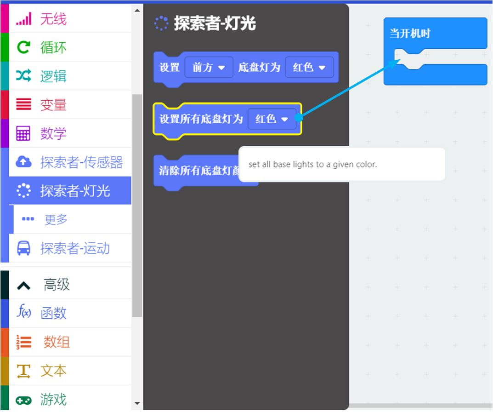

- 选择颜色为绿色，当然你可以选择你喜欢的颜色，编写好的程序如下

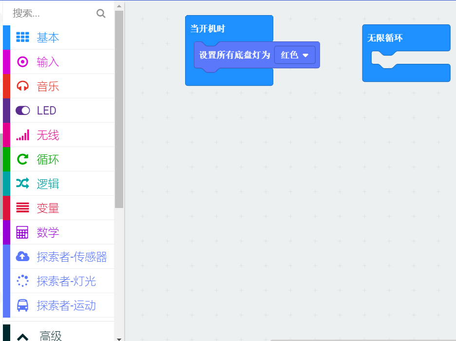

- 点击界面左侧的 **下载** 按钮, MakeCode将为我们编译并生成一个名字为 **microbit-first-program.hex** 的可执行文件，这个程序随后我们将传输到microbit
  的磁盘里运行，生成的文件的名字取决于你建立工程时制定的名字。将文件保存在电脑的某个位置

第5步 将程序传输到机器人
---------------------------

将上一步生成的 **microbit-first-program.hex** 文件拷贝到第1步中名为 **MICROBOT** 的磁盘里面

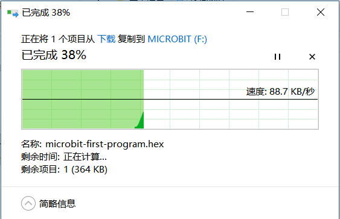

第5步 测试你的程序
--------------------

将USB线缆从机器人拔下，打开电源开关，机器人将自动运行你烧写的程序，查看一下机器人底盘灯的颜色是不是你
程序里面设定那样

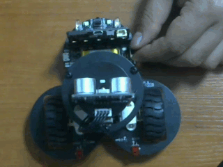

