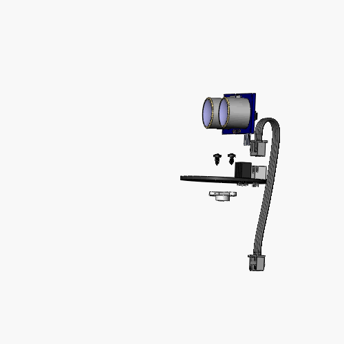

探索者机器人安装指南
=======================================

在这里你将学会如何一步一步安装你的探索者机器人

包装内容物
----------

机器人是以零件的形式达到您手中的，打开包装，看看都有哪些零件吧

安装步骤
--------

接着我们将一步一步地指引你如何组装属于你自己地机器人，让我们开始动手吧

第1步 组装云台转台
~~~~~~~~~~~~~~~~~~

你需要准备 **舵机安装包**，**超声波雷达板** 和 **十字螺丝刀**，按照下面地步骤
完成安装

   

