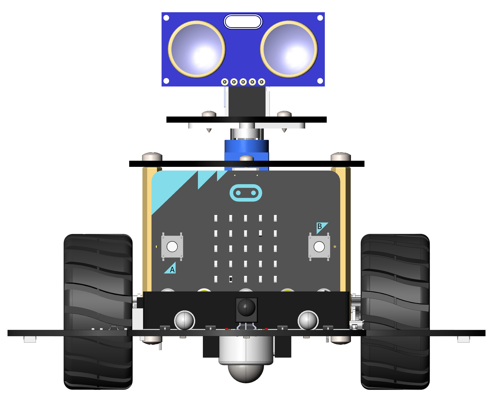

墨豆机器人
=======================================

欢迎使用墨豆机器人
----------------------

墨豆是DIDABOT团队针对BBC microbit开发板量身打造的一款教育机器人产品，
它不仅具有小巧炫酷的造型，还具有丰富而有趣的功能。通过对机器人组装、编程和控制，
不仅能够锻炼您的编程能力、逻辑思维能力，更能够锻炼实践动手能力，边玩边学，边学边玩，
起到寓乐于教的目的。

功能特点
   - 针对BBC microbit量身打造
   - 两颗100级可编程高亮探照灯
   - 两颗100级可编程高亮尾灯
   - 3颗可编程RGB底盘氛围灯
   - 2台大扭矩、可编程减速电机
   - 两轮差分驱动底盘，移动灵活
   - 红外巡线传感器
   - 红外遥控传感器
   - 400mm宽范围超声波测距雷达
   - 180度可编程旋转云台
   - 2000mAh可充电聚合物锂电池，5小时续航
   - 充电指示、电源指示器
   - 支持makecode图形化编程和python编程

适用人群
    8-14岁青少年、机器人教师、创客及机器人爱好者

 
快速开始
-------------

如果您是第一次拿到墨豆机器人，迫不及待地想要快速体验一下它神奇的功能，请按照
下面的指引快速开始吧

* **第1步**:
  :doc:`组装你的机器人 <quick-start/installation>`

* **第2步**:
  :doc:`为机器人充电 <quick-start/charging>`

* **第3步**:
  :doc:`第一个机器人程序 <quick-start/first-program>`

.. toctree::
   :maxdepth: 2
   :hidden:
   :caption: Quick Start

   quick-start/installation
   quick-start/charging
   quick-start/first-program

硬件
-------

如果您已经小小体验过墨豆机器人的神奇之处，想要更深入地了解它，这里我们将为您详细介绍
:doc:`墨豆机器人硬件 <hardware/index>` 的组成和原理

.. toctree::
   :maxdepth: 2
   :hidden:
   :caption: Hradware Description

   hardware/index

软件
-------

如果您已经对墨豆有了充分的了解，想要学习如果为它编程来控制它，这里我们为您提供了一系列
:doc:`编程课程 <tutorials/index>` 供您学习

.. toctree::
   :maxdepth: 2
   :hidden:
   :caption: Programming Tutorials

   tutorials/index

