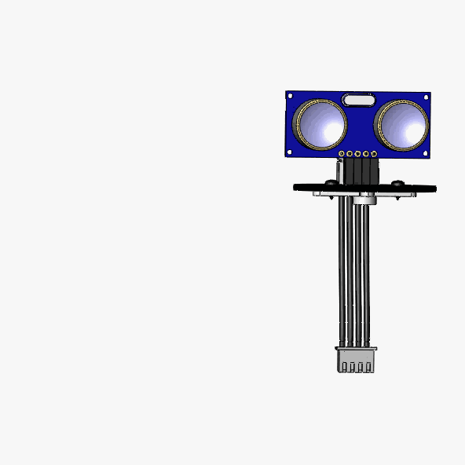
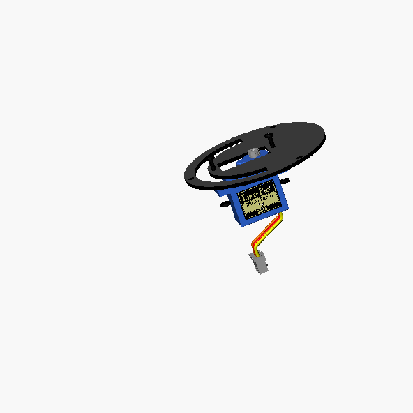
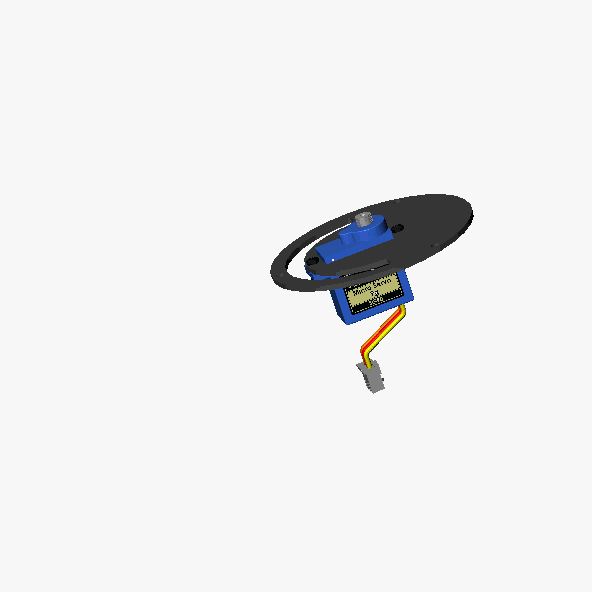
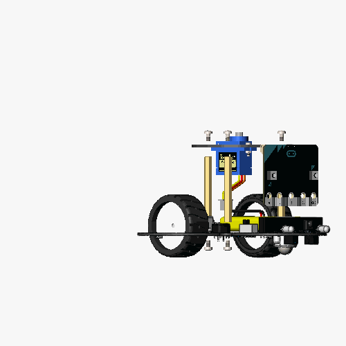
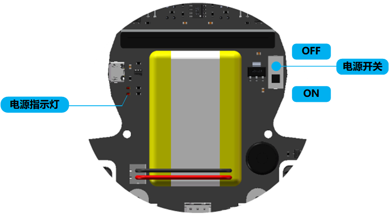
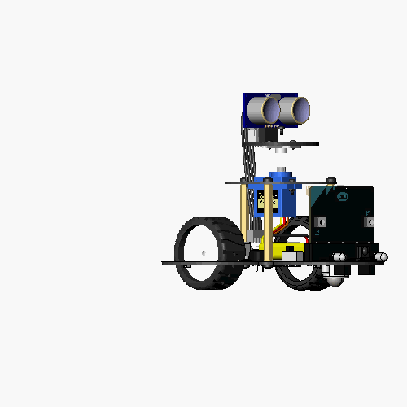
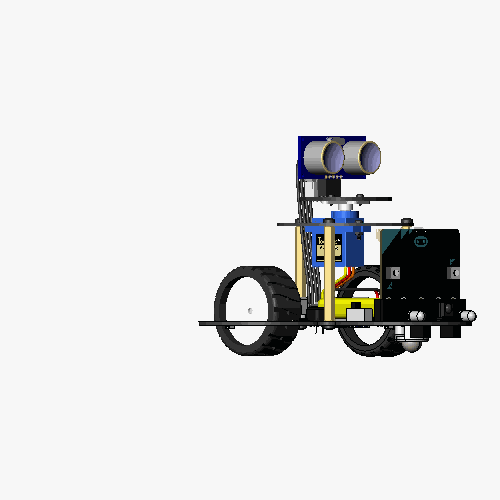

组装你的机器人
=======================================

在这里你将学会如何一步一步安装你的探索者机器人

包装内容物
----------

机器人是以零件的形式达到您手中的，打开包装，看看都有哪些零件吧

.. image:: ../images/installation/accessories.png
   :width: 661px 
   :height: 876px
   :scale: 80 %
   :align: center

安装步骤
--------

接着我们将一步一步地指引你如何组装属于你自己地机器人，让我们开始动手吧

第1步 : 组装云台转台
~~~~~~~~~~~~~~~~~~~~~

你需要准备 

* **舵机支臂 × 1**
* **超声波雷达板 × 1** 
* **小号自攻钉螺丝 × 2**
* **超声波传感器 × 1**
* **超声波传感器线缆 × 1**
* **十字螺丝刀 × 1**

按照下面地步骤完成安装

.. image:: ../images/installation/install-header.gif
   :width: 500px 
   :height: 500px
   :scale: 70 %
   :align: center

安装完成后的效果

第2步 ：组装云台基座
~~~~~~~~~~~~~~~~~~~~~

你需要准备

* **伺服舵机 × 1**
* **云台支撑板 × 1**
* **M2舵机安装螺钉 x 2**
* **M2舵机安装螺母 x 2**
* **十字螺丝刀 × 1**

按照下面的步骤完成安装

安装完成后的效果

第3步 ：连接主板和云台基座
~~~~~~~~~~~~~~~~~~~~~~~~~~~~

你需要准备

* **组装完毕的云台基座 × 1**
* **机器人主板 × 1**
* **microbit主板 × 1**
* **M3铜柱 x 3**
* **M3螺钉 x 6**
* **十字螺丝刀 × 1**

按照下面的步骤完成安装

安装完成后的效果

第4步 连接云台头和基座
~~~~~~~~~~~~~~~~~~~~~~~~~~

你需要准备

* **组装完毕的云台状态 × 1**
* **组装完毕的云台基座和主板 × 1**
* **M2舵机螺钉**
* **十字螺丝刀**

将机器人电源开关拨至 **ON** 状态打开电源，默认的出厂程序会自动校准舵机零点

几秒钟后将机器人电源开关拨至 **OFF** 状态关闭电源，按照下面的步骤完成安装,注意
超声波传感器要面向机器人的正前方安装

安装完成后的效果

好了，恭喜你完成了探索者机器人的安装，接下来你可以选择学习中心其它的课程去学习了。

   

